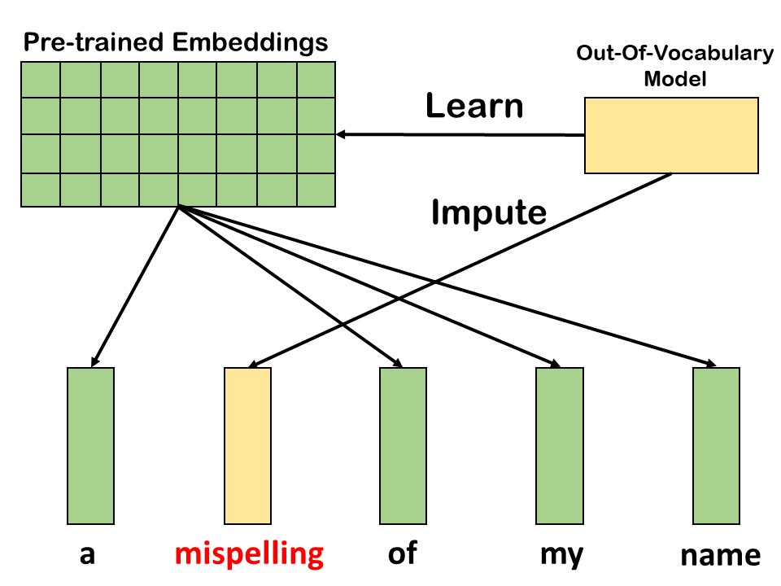
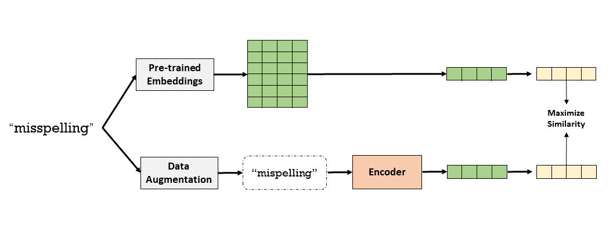

# Imputing Out-of-Vocabulary Embeddings with LOVE Makes Language Models Robust with Little Cost
LOVE is accpeted by ACL22 main conference as a [long paper (**oral**)](https://arxiv.org/abs/2203.07860). 
This is a Pytorch implementation of our paper. 

## What is LOVE?
LOVE, **L**earning **O**ut-of-**V**ocabulary **E**mbeddings, is the name of our beautiful model given by [Fabian Suchanek](https://suchanek.name/).

LOVE can produce word embeddings for arbitrary words, including out-of-vocabulary words like misspelled words, rare words, domain-specific words..... 

Specifically, LOVE follows the principle of mimick-like models [2] to generate vectors for unseen words, by learning
the behavior of pre-trained embeddings using only the surface form of words, as shown in the below figure.



To our best knowledge, LOVE is the first one to use contrastive learning for word-level representations.
The framework is shown in the below figure, and it uses various data augmentations to generate positive samples.
Another distinction is that LOVE adopts a novel fully attention-based encoder named PAM to mimic the vectors from pre-trained embeddings.
You can find all details in our paper.



## The benefits of LOVE?
### 1. Impute vectors for unseen words
As we know, pre-trained embeddings like FastText use a fixed-size vocabulary, which means the performance decreases a lot when dealing with OOV words.

LOVE can mimic the behavior of pre-trained language models (including BERT) and impute vectors for any words.

For example, _mispleling_ is a typo word, and LOVE can impute a reasonable vector for it:
```python
from produce_emb import produce

oov_word = 'mispleling'
emb = produce(oov_word)
print(emb[oov_word][:10])

## output [-0.0582502  -0.11268596 -0.12599416  0.09926333  0.02513208  0.01140639
 -0.02326127 -0.007608    0.01973115  0.12448607]
```

### 2. Make LMs robust with little cost
LOVE can be used in a plug-and-play fashion with FastText and BERT, where it significantly improves their robustness.
For example, LOVE with 6.5M can work with FastText (900+M) together and improve its robustness, as shown in the figure:


## The usage of LOVE
Clone the repository and set up the environment via "requirements.txt". Here we use python3.6. 
```python
pip install -r requirements.txt
```
### Data preparation
In our experiments, we use the FastText as target vectors [1]. [Download](https://fasttext.cc/docs/en/english-vectors.html).
After downloading, put the embedding file in the path `data/`.

### Training
First you can use `-help` to show the arguments
```python
python train.py -help
```
Once completing the data preparation and environment setup, we can train the model via `train.py`.
We have also provided sample datasets, you can just run the mode without downloading.
```python
python train.py -dataset data/wiki_100.vec
```

### Evaluation

#### Intrinsic
To show the intrinsic results of our model, you can use the following command and 
we have provided the trained model we used in our paper. 

```python
python evaluate.py

## expected output
model parameters：~6.5M
[RareWord]: [plugin], 42.6476207426462 
[MEN  ]: [plugin], 68.47815031602434 
[SimLex]: [plugin], 35.02258000865248 
[rel353]: [plugin], 55.8950046345804 
[simverb]: [plugin], 28.7233237185531 
[muturk]: [plugin], 63.77020916555088 
```

#### Extrinsic

Here, SST2 (Text Classification) and CoNLL03 (Named Entity Recognition) are used for extrinsic evaluations.
As LOVE can mimic the behaviors of dynamic (BERT) and static (Fasttext) embeddings, we show four different types of evaluations:
1. **CNN Text Classification**. Encoder: CNN; Embedding: LOVE-FastText; Code: [#]()
2. **RNN NER**. Encoder: Bi-LSTM+CRF; Embedding: LOVE-FastText; Code: [rnn ner](https://github.com/tigerchen52/LOVE/tree/master/extrinsic/rnn_ner)
3. **BERT Text Classification**. Encoder: BERT-uncased; Embedding: LOVE-BERT; Code: [undo]()
4. **BERT NER**. Encoder: BERT-cased; Embedding: LOVE-BERT; Code: [undo]()


**1. RNN NER**

First, to generate embeddings for all words in CoNLL03
```python
from produce_emb import gen_embeddings_for_vocab
vocab_path = "extrinsic/rnn_ner/output/words.txt"
emb_path = "extrinsic/rnn_ner/output/love.emb"
gen_embeddings_for_vocab(vocab_path=vocab_path, emb_path=emb_path)
```
Then, to train a Bi-LSTM-CRF model based on the embeddings obtained by LOVE
Go to the folder ```extrinsic/rnn_ner``` and run the script:
```
cd extrinsic/rnn_ner
python main.py
```
After, you can see score like this:
```
accuracy:  95.35%; precision:  83.83%; recall:  76.03%; FB1:  79.74
test acc on test set: 79.74
```

**2. CNN Text Classification**

Likewise, to generate embeddings for all words in SST2
```python
from produce_emb import gen_embeddings_for_vocab
vocab_path = "extrinsic/cnn_text_classification/output/words.txt"
emb_path = "extrinsic/cnn_text_classification/output/love.emb"
gen_embeddings_for_vocab(vocab_path=vocab_path, emb_path=emb_path)
```
Then, to train a CNN model based on the embeddings obtained by LOVE
Go to the folder ```extrinsic/cnn_text_classification``` and run the script:
```
cd extrinsic/cnn_text_classification
python main.py
```
After, you can see score like this:
```
epoch = 10
Epoch: 01 | Epoch Time: 0m 10s
	Train Loss: 0.652 | Train Acc: 62.18%
	 Val. Loss: 0.579 |  Val. Acc: 72.52%
Epoch: 02 | Epoch Time: 0m 15s
	Train Loss: 0.538 | Train Acc: 73.29%
	 Val. Loss: 0.514 |  Val. Acc: 75.57%
Epoch: 03 | Epoch Time: 0m 20s
	Train Loss: 0.455 | Train Acc: 79.44%
	 Val. Loss: 0.491 |  Val. Acc: 76.93%
Epoch: 04 | Epoch Time: 0m 11s
	Train Loss: 0.405 | Train Acc: 82.32%
	 Val. Loss: 0.477 |  Val. Acc: 77.85%
Epoch: 05 | Epoch Time: 0m 7s
	Train Loss: 0.359 | Train Acc: 85.15%
	 Val. Loss: 0.497 |  Val. Acc: 76.01%
Epoch: 06 | Epoch Time: 0m 10s
	Train Loss: 0.326 | Train Acc: 87.19%
	 Val. Loss: 0.492 |  Val. Acc: 75.95%
Epoch: 07 | Epoch Time: 0m 24s
	Train Loss: 0.282 | Train Acc: 89.47%
	 Val. Loss: 0.519 |  Val. Acc: 74.95%
Epoch: 08 | Epoch Time: 0m 15s
	Train Loss: 0.242 | Train Acc: 91.56%
	 Val. Loss: 0.461 |  Val. Acc: 79.26%
Epoch: 09 | Epoch Time: 0m 7s
	Train Loss: 0.215 | Train Acc: 93.04%
	 Val. Loss: 0.460 |  Val. Acc: 79.60%
Epoch: 10 | Epoch Time: 0m 11s
	Train Loss: 0.184 | Train Acc: 94.32%
	 Val. Loss: 0.501 |  Val. Acc: 77.20%
	-------------------------------------------------------------
	Test Loss: 0.422 | Test Acc: 80.42%
```


## Reference
[1] Bojanowski, Piotr, et al. "Enriching word vectors with subword information." Transactions of the Association for Computational Linguistics 5 (2017): 135-146.

[2] Pinter, Yuval, Robert Guthrie, and Jacob Eisenstein. "Mimicking Word Embeddings using Subword RNNs." Proceedings of the 2017 Conference on Empirical Methods in Natural Language Processing. 2017.


