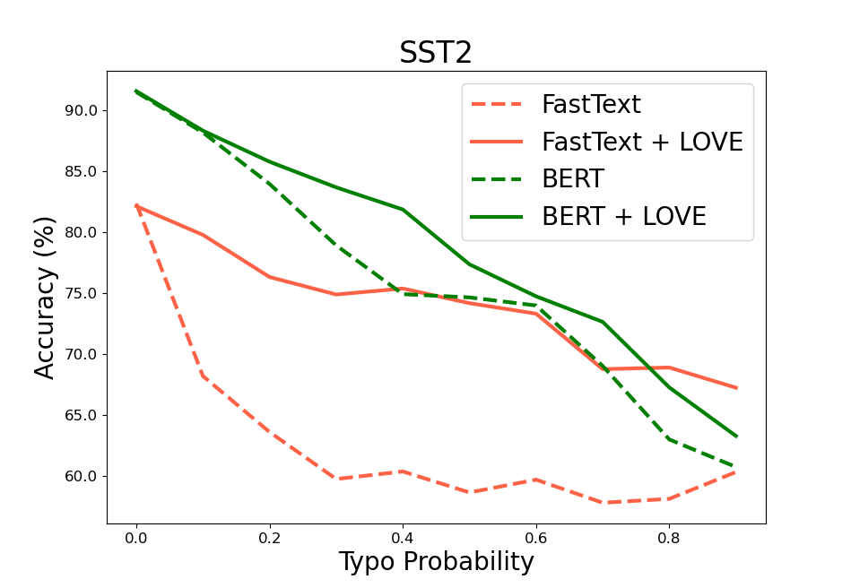

# Imputing Out-of-Vocabulary Embeddings with LOVE Makes Language Models Robust with Little Cost
LOVE is accpeted by ACL22 main conference as a [long paper](https://arxiv.org/abs/2203.07860). 
This is a Pytorch implementation of our paper. 

## What is the LOVE model?
LOVE, **L**earning **O**ut-of-**V**ocabulary **E**mbeddings, is the name of our beautiful model given by [Fabian Suchanek](https://suchanek.name/).

LOVE can produce word embeddings for arbitrary words, including out-of-vocabulary words like misspelled, rare words, domain-specific words..... 

Specifically, LOVE follows the principle of mimick-like models [2] to generate vectors for unseen words, by learning
the behavior of pre-trained embeddings using only the surface form of words, as shown in the below figure.


To our best knowledge, LOVE is the first one to use contrastive learning for word-level representations.
The framework are shown in the below figure, and it uses various data augmentations to generate positive samples.
Another distinction is that LOVE adopts a novel fully attention-based encoder named PAM to mimic the vectors from pre-trained embeddings.
You can find all details in our paper.


## The benefits of LOVE?
### 1. Impute vectors for unseen words
As we know, pre-trained embeddings like FastText use a fixed-size vocabulary, which means the performance decreases a lot when dealing with OOV words.

LOVE can mimic the behavior of pre-trained language models (including BERT) and impute vectors for any words.

For example, _mispleling_ is a typo word, and LOVE can impute a reasonable vector for it:
```
from produce_emb import produce

oov_word = 'mispleling'
emb = produce(oov_word)
print(emb[oov_word][:10])

## output [-0.0582502  -0.11268596 -0.12599416  0.09926333  0.02513208  0.01140639
 -0.02326127 -0.007608    0.01973115  0.12448607]
```

### 2. Make LMs robust with little cost
LOVE can be used in a plug-and-play fashion with FastText and BERT, where it significantly improves their robustness.
For example, LOVE with 6.5M can work with FastText (900+M) together and improve its robustness, as shown in the figure:



## The usage of LOVE
Clone the repository and set up the environment via "requirements.txt". Here we use python3.6. 
```
pip install -r requirements.txt
```
### Data preparation
In our experiments, we use the FastText as target vectors [1]. [Downlaod](https://fasttext.cc/docs/en/english-vectors.html).
After downloading, put the embedding file in the path `data/` 

### Training
First you can use `-help` to show the arguments
```
python train.py -help
```
Once completing the data preparation and environment setup, we can train the model via `train.py`.
We have also provided sample datasets, you can just run the mode without downloading.
```
python train.py -dataset data/wiki_100.vec
```

### Evaulation
To show the intrinsic results of our model, you can use the following command and 
we have provided the trained model we used in our paper. 

```
python evaluate.py
```


## Reference
[1] Bojanowski, Piotr, et al. "Enriching word vectors with subword information." Transactions of the Association for Computational Linguistics 5 (2017): 135-146.

[2] Pinter, Yuval, Robert Guthrie, and Jacob Eisenstein. "Mimicking Word Embeddings using Subword RNNs." Proceedings of the 2017 Conference on Empirical Methods in Natural Language Processing. 2017.


